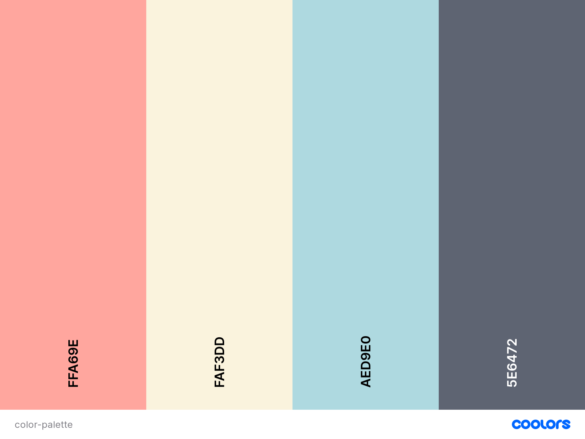

# frozan 

[Link to the website](https://marialundgren.github.io/frozan/)

This website is created for an ice cream company called frozan. The purpose of the website is to create an online presence for the company to have a space 
where customers can get information about the comany and the product, see where the shops are located and be able to contact the company if they want to.
The company and project are fictional and only created for educational purpose. 

## UX
Below the structure and how the website is planed will be presented using the five scopes of UX.

### 1 Strategy 
The main reason for this website is to create an online presence for the company and to give information about the company and the product 
they are selling. The main USP for the company is that they have vegan oat-based and gluten free ice cream and therefor it is important to 
premiere this content on the website. The structure of the website needs to be easy so that the user immediately understands how to use the 
website and its purpose. The main target audience will be people who eats a plant-based diet or wants to eat a more plant-based diet. Since 
the site is B2C there will be large images and illustrations on the website and small chunks of content to make the website compelling and to 
feel overloaded with content for the users.

### 2 Scope
Site owners’ goal: To create an online presence and inform about the company, the product, and location.

User goals: Get information about the company, the product and where the ice cream shops are available.

To prioritize between what would be included on this website I first wrote down ideas of what 
could be included and then I made an Importance and Viability/feasibility chart to determine what ideas to 
include in this version and what could be potential features for the future. The ideas in the grey box are 
the one that will be included in this version and the other could be included in future versions. The user
stories were written based on the ideas that are in the grey box in the chart. 
- Importance and Viability/feasibility chart

User stories 
-	As a user I want to get information about the company.
-	As a user I want to get information about the ice cream product the company is selling. 
-   As a user I want to know what flavours of the ice cream the company offers. 
-	As a user I want to be able to contact the company with questions and feedback. 
-   As a user I want to know the opening hours of the ice cream shops. 
-	As a user I want to know where the ice cream shops are located. 
-   As a user I want to see on where the map the ice cream shops are located. 
-	As a user I want to be able to find the social channels of the company. 

### 3 Structure 
The structure will have a linear narrative so that it is easy for the user to 
use the website from the start, and this is important so that it will not be
confusing for someone who visits the website for the first time to find the 
information that they need. The most important content will be presented first
on the webpage and content to get the user interested, then moving down the 
website more specific information will be presented.

### 4 Skeleton
That the company sells vegan oat-based ice cream will be the first thing 
presented on the website since this is the information that are the most 
prioritized on the webpage. Then moving down the structure more specific 
content about the company, flavors, locations and at the end a contact 
form for the customers who wants to contact the company will be presented.

The website has a lot of whitespace in the design, and this is both to 
make the design mor minimalistic and less cluttered but also because to 
have a few features increases the usability which is highly prioritized 
on the website. 

Figma were used to create the wireframes that are linked below.

- [Desktop](wireframes/desktop-wireframe.pdf) 
- [Tablet](wireframes/tablet-wireframe.pdf)
- [Mobile](wireframes/mobile-wireframe.pdf)

### 5 Surface

#### Colors
The color palette chosen for this project is soft to match the theme of 
icecream and feel fun. The pink color beeing the strongest is used sparsingly 
throug the design to direct attention to sertain elements and the dark grey
color is used for text to have a good legibility but still be softer than 
a pure black color for the font.

#### Typography 
Both fonts chosen for this project is found on Google fonts, Quicksand
is used for the logo and for the rest of the text Open Sans is used since 
it is a font that suits the web and have good legibility. The fallback 
font is Sans Seriff. 

## Features 

- Navbar 
    - The navbar will be sticky so that the user always easily can get to 
the different part of the website. The navbar becomes a drop down menue
on tablet and mobile devices. 
- Footer 
    - The footer will contain links to social platforms so the user can find 
the company on diffent platforms and the conpany logo. 
- Home 
    - The home section will conatin a hero image and the company logo and 
    text about the product that the company sells. 
- About us
    - The about us section will contain a short text about the company and 
    a image. 
- The ice cream
    - The ice cream section will contain a short text about the icecream with
    a image next to it and beneath all the different flavours of icecream
    that the company offers. 
- Our Location 
    - The location section will contain three buttons with the cities that the
    ice cream shops are avalibe in and a Google maps where you can see where in 
    the city the shops are located. This section will also conatin the opening
    hours of the ice cream shops. 
- Contact 
    - The contact section will contain a contact form that users can use if they
    want to get in contact with the company.

## Technologies Used

- HTML5 was used to make the structure of the website.
- CSS used to add style to the project. 
- Javascript was used to make the website interactive. 
- Bootstrap was used to style sertain elements and to make tha website responsive. 
- Font Awesome was used for the icons in the footer. 
- Google Fonts was used to import the font Open Sans used in the project. 
- Gitpod was used to develop the project. 
- Github used to store the project. 
- Figma was used to make wireframes for the project. 
- TinyJPG was used to compress images. 
- Photoshop was used to edit som of the images used in the project. 
- Illustrator was used to make som of the components used in the project. 

## Testing

### Validation

### Features 

#### Navbar 

##### Manual testing of the navbar.
- Clicking on the logo scolls the page back up to the start of the page. 
- Clicking on the home link scrolls the page back up to the start of the page. 
- Clicking on the about us link scrolls the page to the about us section. 
- Clicking on the the ice cream link scrolls the page to the ice cream section. 
- Clicking on the locations link scrolls the page to the our locations section. 
- Clicking on the contact link scrolls the page to the contact section. 
- Hovering over the links to make sure they become darker when hovering over them. 
- Scrolling down the page to make sure the navbar stays at the top of the browser window. 

#### Footer

##### User stories testing
-	As a user I want to be able to find the social channels of the company. 
    - In the footer there are icons that links to social media if the user wants to connect with the gym there. 

##### Manual testing of the footer. 
- Clicking on the logo scolls the page back up to the start of the page.
- Clicking og the Instagram icon and that opens up instagram.com in a new browser window.
- Clicking og the Facebook icon and that opens up facebook.com in a new browser window.
- Clicking og the Linkedin icon and that opens up linkedin.com in a new browser window. 
- Hovering over the social icons to make sure they become darker when hovering over them. 

#### About us 

##### User stories testing
-	As a user I want to get information about the company.
    - In the about us section it is a section the user can read to get information about the company. 

##### Manual testing of about us text animation. 
- Scrolling down to this section to make sure the text fades in when scrolling to it. 

#### The ice cream 

##### User stories testing
-	As a user I want to get information about the ice cream product the company is selling. 
    - In the ice cream section the user can read a text to get more information about the ice cream product the company sells.
-   As a user I want to know what flavours of the ice cream the company offers. 
    - In the ice cream section there is also a section that shows all the flavours of ice cream that the company offers. 

##### Manual testing of the ice cream text animation. 
- Scrolling down to this section to make sure the text fades in when scrolling to it. 

#### Our locations 

##### User stories testing
-   As a user I want to know the opening hours of the ice cream shops. 
    - Next to the map in the our locations section the user can see the opening hours of the ice cream shops.
-	As a user I want to know where the ice cream shops are located. 
    - If the user clicks on the marker at the google maps the adress of that ice cream shop appears on the map. 
-   As a user I want to see on where the map the ice cream shops are located. 
    - On the google maps in our locations section the user can see where on the map the ice cream shops are located with help from the marker on the map. 

##### Manual testing of google map. 
- When clicking on Göteborg button the map showes the ice cream shop location in Göteborg.
- When hover in over the marker at the göteborg location the text "frozan Göteborg" shows.
- When clicking on the marker at the göteborg location it shows the adress for that location.  
- When clicking on Malmö button the map showes the ice cream shop location in Malmö.
- When hover in over the marker at the malmö location the text "frozan Malmö" shows. 
- When clicking on the marker at the malmö location it shows the adress for that location. 
- When clicking on Stockholm button the map showes the ice cream shop location in Stockholm.
- When hover in over the marker at the stockholm location the text "frozan Stockholm" shows. 
- When clicking on the marker at the scockholm location it shows the adress for that location. 
- Hovering over the buttons to make sure they become darker when hovering over them. 

#### Contact 

##### User stories testing
-	As a user I want to be able to contact the company with questions and feedback. 
    - In the contact section the user can fill out a contact form for any questions or feedback that the user have for the company. 

##### Manual testing of contact form.
- Trying to send in form empty and message appears to fill out required fields.
- Trying to send in form without a valid email adress and message appears that the email needs to contain a @. 
- Submitting the form with all required information and a modal with a thank you message appears and the form clears all the fields. 
- Fill out all required fields in the form, disconnecting from internet and trying to submit and an error message appears that asks me to try again later appears. 
- Hovering over the submit button to make sure it becomes darker when hovering over it. 

### Responsiveness

The responsiveness is tested using Chrome and Mozilla Firefox DevTools.

In Chrome DevTools these devices are tested for responsiveness: 

- Moto 4
- Galaxy S5
- Pixel 2
- Pixel 2 XL
- iPhone 5/SE
- iPhone 6/7/8
- iPhone 6/7/8 Plus
- iPhone X
- iPad
- iPad Pro
- Surface Duo
- Galaxy Fold

In Mozilla Firefox DevTools these devices are tested for responsiveness: 

- Galaxy S9/S9+
- iPad
- iPhone 6/7/8
- iPhone 6/7/8 Plus
- iPhone X/XS
- Kindle Fire HDX

### Browsers

### Performance with lighthouse

### Bugs

- When using d-flex on the logo in the footer to get it to be aligned to the left on desktop but in the center 
on smaller screen sizes the image loses it integrity and get stetched out. I fixed this by setting a fixed height to the logo in the footer and the widt to auto so that 
the logo don't change size when the sreen does but stay at the same size all the time. I read a bit about this problem and it seem that you have to give an image a set size if you but it in a flex container to not stretch to cover the containers width.
- The bootstrap class sticky-top didn't work on the navbar. I read on stack overflow that this colud be a problem if you hav the navbar in a div or section instead of nav but since i didn't have that I couldnt find a reason for this. To fix this I implemented the fixed position to the navbar in my css document
instead to make the navbar sticky.
- My google maps map was loading but i got an error message in devtools saying that the initMap() wasn't a function. I found another person that seemd to have a similar problem it was suggested that he take away the async from the script loading the api because it made a problem with the callback function. But then I got another error message saying that google was not defined wich I solved by using the window onload event to make it wait until the whole page was loaded. 
## Deployment

### Deploy 

#### Deploy 
1. Log in to your github account. 
2. Find the repository you want and click on it. 
3. In the toolbar click on settings. 
4. In the menu to the left click on Pages. 
5. Select the branch master and click on save. 
6. The link is now avalible in the high-lighted green area on GitHub Pages. 
7. When clicking on the link you will access the website. 

#### Run code locally 
1. Find the respository you want and click on it. 
2. Abouve all the files in the repository click on the green gitpod button. 
3. This opens a new copy of the workspace on gitpod. You should only do this once and then you can access the workspace directly from gitpod. 
If you press the green gitpod button again it will create a new copy of the workspace on gitpod. 
4. You can now edit the workspace locally. 
5. If you want to open a prewiev window of the workspace in the browser you can type in the command: python3 -m http.server in the terminal and then click open browser in the pop-up window down to the right. 

### Run code locally 

## Credits 

### Code 

### Media 

### Acknowledgements
