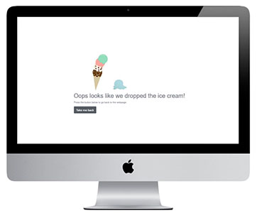

# frozan 

[Link to the website](https://marialundgren.github.io/frozan/)

This website is created for an ice cream company called frozan. The purpose of the website is to create an online presence for the company to have a space 
where customers can get information about the company and the product, see where the shops are located, and be able to contact the company if they want to.
The company and project are fictional and only created for educational purposes. 

## UX
Below the structure and how the website is planed will be presented using the five scopes of UX.

### 1 Strategy 
The main reason for this website is to create an online presence for the company and to give information about the company and the product 
they are selling. The main USP for the company is that they have vegan oat-based and gluten-free ice cream and therefore it is important to 
premiere this content on the website. The structure of the website needs to be easy so that the user immediately understands how to use the 
website and its purpose. The main target audience will be people who eat a plant-based diet or wants to eat a more plant-based diet. Since 
the site is B2C there will be large images and illustrations on the website and small chunks of content to make the website compelling and to 
feel overloaded with content for the users.

### 2 Scope
Site owners’ goal: To create an online presence and inform about the company, the product, and location.

User goals: Get information about the company, the product, and where the ice cream shops are available.

To prioritize what would be included on this website I first wrote down ideas of what 
could be included and then I made an Importance and Viability/feasibility chart to determine what ideas to 
include in this version and what could be potential features for the future. The ideas in the grey box are 
the ones that will be included in this version and the other could be included in future versions. The chart is made based on what was important to have on the website for now and how much time it would take to do it and how hard the ideas would be to implement. The user stories were written based on the ideas that are in the grey box in the chart. 
- [Importance and Viability/feasibility chart](assets/docs/images/importance-viability-chart.jpg)

User stories 
-	As a user, I want to get information about the company.
-	As a user, I want to get information about the ice cream product the company is selling. 
-   As a user, I want to know what flavors of the ice cream the company offers. 
-	As a user, I want to be able to contact the company with questions and feedback. 
-   As a user, I want to know the opening hours of the ice cream shops. 
-	As a user, I want to know where the ice cream shops are located. 
-   As a user, I want to see on where the map the ice cream shops are located. 
-	As a user, I want to be able to find the social channels of the company. 

### 3 Structure 
The structure will have a linear narrative so that it is easy for the user to 
use the website from the start, and this is important so that it will not be
confusing for someone who visits the website for the first time to find the 
information that they need. The most important content will be presented first
on the webpage and content to get the user interested, then moving down the 
website more specific information will be presented.

### 4 Skeleton
That the company sells vegan oat-based ice cream will be the first thing 
presented on the website since this is the information that is the most 
prioritized on the webpage. Then moving down the structure more specific 
content about the company, flavors, locations, and at the end a contact 
form for the customers who want to contact the company will be presented.

The website has a lot of whitespace in the design, and this is both to 
make the design more minimalistic and less cluttered but also because to 
have few features increases usability, which is highly prioritized.

Figma was used to create the wireframes that are linked below.

- [Desktop](assets/docs/wireframes/desktop-wireframe.pdf) 
- [Tablet](assets/docs/wireframes/tablet-wireframe.pdf)
- [Mobile](assets/docs/wireframes/mobile-wireframe.pdf)

#### Changes from the wireframes made in the project 
In the process, I have not followed the wireframes exactly. The changes are mostly in the tablet version of the project where I have developed the website differently than in the wireframes. In the about us section and the ice cream section I chose to have the pictures and text next to each other like have on the desktop version on the wireframe rather than having the text above the image as in the wireframe for tablets. The reason for this is that with the chosen images and the length of the text that is placed in these sections I thought that it looked better to have them side by side than the text above the image. 

### 5 Surface

#### Colors
The color palette chosen for this project is soft to match the theme of 
ice cream and feel fun. The pink color being the strongest is used sparingly 
hrough the design to direct attention to certain elements and the dark grey
color is used for text to have good legibility but still be softer than 
a pure black color for the font.

#### Typography 
Both fonts chosen for this project are found on Google fonts, Quicksand
is used for the logo, and for the rest of the text Open Sans is used since 
it is a font that suits the web and has good legibility. The fallback 
font is Sans Serif. 

## Features 

### Existing features

- Navbar 
    - The navbar will be sticky so that the user always easily can get to 
the different parts of the website. The navbar becomes a drop-down menu
on tablet and mobile devices. 
- Footer 
    - The footer will contain links to social platforms so the user can find 
the company on different platforms and the company logo. 
- Home 
    - The home section will contain a hero image and the company logo and 
    text about the product that the company sells. 
- About us
    - The about us section will contain a short text about the company and 
    an image. 
- The ice cream
    - The ice cream section will contain a short text about the ice cream with
    an image next to it and beneath all the different flavors of ice cream
    that the company offers. 
- Our Location 
    - The location section will contain three buttons with the cities that the
    ice cream shops are available in and a Google maps where you can see where in 
    the city the shops are located. This section will also contain the opening
    hours of the ice cream shops. 
- Contact 
    - The contact section will contain a contact form that users can use if they
    want to get in contact with the company. All the fields in the form will be required to 
    fill for the user to be able to send the contact form. When submitting the form with all 
    the valid information a model with a thank you message will appear if the submit was successful. 
    If something is wrong and the form isn't submitted an error message will appear that prompts the user to try again later.  
- 404 page 
    - If the user goes to a non-existing page a 404 page will be implemented with a button that takes them back to the website. 

### Features left to implement 
- A frequently asked questions section. 
- A company blog page. 
- A news/press section. 
- A jobs/careers section. 

## Technologies Used

- [HTML5](https://en.wikipedia.org/wiki/HTML5) was used to make the structure of the website.
- [CSS](https://en.wikipedia.org/wiki/CSS) used to add style to the project. 
- [Javascript]() was used to make the website interactive. 
- [Bootstrap](https://getbootstrap.com/) was used to style certain elements and to make the website responsive. 
- [Font Awesome](https://fontawesome.com/) was used for the icons in the footer. 
- [Google Fonts](https://fonts.google.com/) was used to import the font Open Sans used in the project. 
- [Gitpod](https://www.gitpod.io/) was used to develop the project. 
- [Github](https://github.com/) used to store the project. 
- [Figma](https://www.figma.com/) was used to make wireframes for the project. 
- [TinyJPG](https://tinyjpg.com/) was used to compress images. 
- [Photoshop](https://www.adobe.com/products/photoshop.html) was used to edit some of the images used in the project. 
- [Illustrator](https://www.adobe.com/products/illustrator.html) was used to make some of the components used in the project. 

## Testing

### Validation
- To test the HTML I used the [W3C Markup Validation Service](https://validator.w3.org/#validate_by_input).
    - First I got a warning message in the validator saying that the type attribute for JavaScript resources was unnecessary, after deleting them the validator showed no warnings or errors. 
- To test the CSS I used the [W3C CSS Validation Service](https://jigsaw.w3.org/css-validator/).
    - In the CSS validator I got no errors or warnings on my code. 
- To test the JavaScript I used [JSHint](https://jshint.com/).
    - First I got warning messages about missing semicolon in a few places but after fixing this I got no warnings in JSHint. I didn't have any warnings but in my email.js file and in the maps.js file JSHint tells me that I have undefined and unused variables. This is code that comes from the API and JSHint can't detect it and because of this, it is not defined in JSHint.

### Features 

#### Navbar 

##### Manual testing of the navbar.
- Clicking on the logo scrolls the page back up to the start of the page. 
- Clicking on the home link scrolls the page back up to the start of the page. 
- Clicking on the about us link scrolls the page to the about us section. 
- Clicking on the ice cream link scrolls the page to the ice cream section. 
- Clicking on the locations link scrolls the page to our locations section. 
- Clicking on the contact link scrolls the page to the contact section. 
- Hovering over the links to make sure they become darker when hovering over them. 
- Scrolling down the page to make sure the navbar stays at the top of the browser window. 

    
    

#### Footer

##### User stories testing
-	As a user, I want to be able to find the social channels of the company. 
    - In the footer, there are icons that link to social media if the user wants to connect with the gym there. 

##### Manual testing of the footer. 
- Clicking on the logo scrolls the page back up to the start of the page.
- Clicking on the Instagram icon and that opens up instagram.com in a new browser window.
- Clicking on the Facebook icon and that opens up facebook.com in a new browser window.
- Clicking on the Linkedin icon and that opens up linkedin.com in a new browser window. 
- Hovering over the social icons to make sure they become darker when hovering over them. 

    
    

#### About us 

##### User stories testing
-	As a user, I want to get information about the company.
    - The about us section contains a text that the user can read to get information about the company.

##### Manual testing of about us text animation. 
- Scrolling down to this section to make sure the text fades in when scrolling to it.

    
    

#### The ice cream 

##### User stories testing
-	As a user, I want to get information about the ice cream product the company is selling. 
    - In the ice cream section the user can read a text to get more information about the ice cream product the company sells.
-   As a user, I want to know what flavors of the ice cream the company offers. 
    - In the ice cream section there is also a section that shows all the flavors of ice cream that the company offers. 

##### Manual testing of the ice cream text animation. 
- Scrolling down to this section to make sure the text fades in when scrolling to it.

    
    

    
    

#### Our locations 

##### User stories testing
-   As a user, I want to know the opening hours of the ice cream shops. 
    - Next to the map in our locations section the user can see the opening hours of the ice cream shops.
-	As a user, I want to know where the ice cream shops are located. 
    - If the user clicks on the marker at the google maps the address of that ice cream shop appears on the map. 
-   As a user, I want to see on where the map the ice cream shops are located. 
    - On the google maps in our locations section the user can see where on the map the ice cream shops are located with help from the marker. 

##### Manual testing of Google Maps. 
- When clicking on the Göteborg button the map shows the ice cream shop location in Göteborg.
- When hovering in over the marker at the Göteborg location the text "frozan Göteborg" shows.
- When clicking on the marker at the Göteborg location it shows the address for that location.  
- When clicking on the Malmö button the map shows the ice cream shop location in Malmö.
- When hovering in over the marker at the Malmö location the text "frozan Malmö" shows. 
- When clicking on the marker at the Malmö location it shows the address for that location. 
- When clicking on the Stockholm button the map shows the ice cream shop location in Stockholm.
- When hovering in over the marker at the Stockholm location the text "frozan Stockholm" shows. 
- When clicking on the marker at the Scockholm location it shows the address for that location. 
- Hovering over the buttons to make sure they become darker when hovering over them. 

    
    

#### Contact 

##### User stories testing
-	As a user, I want to be able to contact the company with questions and feedback. 
    - In the contact section the user can fill out a contact form for any questions or feedback that the user has for the company. 

##### Manual testing of contact form.
- Trying to send in form empty and a message appears to fill out required fields.
- Trying to send in form without a valid email address and a message appears that the email needs to contain a @. 
- Submitting the form with all required information and a modal with a thank you message appears and the form clears all the fields. 
- Fill out all required fields in the form, disconnecting from internet, and trying to submit and an error message appears that asks me to try again later appears. 
- Hovering over the submit button to make sure it becomes darker when hovering over it. 

    
    

#### 404 page 

##### Manual testing of 404 page. 
- Trying to go to a page that doesn't exist on my website and I come to the 404 page. 
- Clicking on the take me back button and I go back to the website again.

### Responsiveness

The responsiveness is tested using Chrome and Mozilla Firefox DevTools.

In Chrome DevTools these devices are tested for responsiveness: 

- Moto 4
- Galaxy S5
- Pixel 2
- Pixel 2 XL
- iPhone 5/SE
- iPhone 6/7/8
- iPhone 6/7/8 Plus
- iPhone X
- iPad
- iPad Pro
- Surface Duo
- Galaxy Fold

In Mozilla Firefox DevTools these devices are tested for responsiveness: 

- Galaxy S9/S9+
- iPad
- iPhone 6/7/8
- iPhone 6/7/8 Plus
- iPhone X/XS
- Kindle Fire HDX

### Browsers

The webpage is tested in the following browsers: 

- Google Chrome
- Mozilla Firefox 
- Microsoft Edge
- Safari 
- Opera 

Not supported browsers: 
- Internet Explorer

Comments: 
- The navigation works in Safari however the smooth scroll effect is not supported by Safari so that doesn't work in this browser. 

### Performance with lighthouse

To test the performance of the webpage Lighthouse in Google DevTools was used. To get a higher score on lighthouse smaller images are used for small screens for the images that lighthouse suggested that the images wasn't properly sized. I have also compressed the images used on the website so that the file sizes became smaller. 

The lighthouse scores are presented below. 

#### Desktop

#### Mobile

### Bugs

- When using d-flex on the logo in the footer to get it to be aligned to the left on desktop but in the center,
on smaller screen sizes the image loses its integrity and gets stretched out. I fixed this by setting a fixed height to the logo in the footer and the width to auto so that 
the logo doesn't change size when the screen does but stays at the same size all the time. I read a bit about this problem and it seems that you have to give an image a set size if you put it in a flex container to not stretch to cover the width of the container.
- The bootstrap class sticky-top didn't work on the navbar. I read on stack overflow that this coulud be a problem if you have the navbar in a div or section instead of nav but since I didn't have that I couldn't find a reason for this. To fix this I implemented the fixed position to the navbar in my CSS document
instead to make the navbar sticky.
- My google maps map was loading but I got an error message in Chrome DevTools saying that `initMap()` wasn't a function. I found another person in code institute slack channel that had the same issue it was suggested to him that he take away `async` from the script loading the API because it caused a problem with the callback function. I took away async and that fixed this error message. But then I got another error message saying that google was not defined. I found a thred about this problem on [Stack Overflow](https://stackoverflow.com/questions/41065766/initmap-is-not-a-function-google-maps-javascript/41065976) where one person was using the `window.onload` event in the initMap function to make it wait for the whole page to load. I used the `window.onload` in my code and it fixed the problem and my map was working. 

## Deployment

### Deploy 
1. Log in to your GitHub account. 
2. Find the repository you want and click on it. 
3. In the toolbar click on settings. 
4. In the menu to the left click on Pages. 
5. Select the branch master and click on save. 
6. The link is now available in the high-lighted green area on GitHub Pages. 
7. When clicking on the link you will access the website. 

### Run code locally 
1. Find the repository you want and click on it. 
2. Above all the files in the repository click on the green Gitpod button. 
3. This opens a new copy of the workspace on Gitpod. You should only do this once and then you can access the workspace directly from Gitpod. 
If you press the green Gitpod button again it will create a new copy of the workspace on Gitpod. 
4. You can now edit the workspace locally. 
5. If you want to open a preview window of the workspace in the browser you can type in the command: `python3 -m http.server` in the terminal and then click open browser in the pop-up window down to the right. 

## Credits 

### Code 
Most of the code in this project is written by me however, some smaller sections are gotten from others, these are presented below. 

- Bootstrap is used to make the content responsive and to style some elements, like buttons. 
- The navbar is taken from bootstrap and customized to fit my project. 
- The contact form is taken from bootstrap and customized to fit my project. 
- In the CSS file I used a piece of code at the top to fix a layout problem on smaller screen sizes that I found in
[this](https://stackoverflow.com/questions/46012482/unwanted-white-space-on-right-side-in-mobile-view/46012924) thread at Stack Overflow. 
- I used the Email.js documentation to help implement the email.js API. The section taken from the documentation is commented on in the code. 
- The function to send an email when filling out the contact form is taken from code institutes lesson on Email.js and customized to fit my project.
The code that I took from this lesson is commented in the regarding place. 
- To help implement the Google Maps API I got a lot of help from the google maps API documentation. 
- To customize the map I also got a lot of help from Eamonn Smyth's document "How to google maps" found in code institutes slack channel. 
I also took some code from his document and customized it to my project, these places are commented on in the code. 

### Media 
- Hero image by [Kenta Kikuchi](https://unsplash.com/@kentas_photography) from [Unsplash](https://unsplash.com/).
- About us image by [Jonathan Borba](https://unsplash.com/@jonathanborba) from [Unsplash](https://unsplash.com/). 
- The ice cream image by [Elza Kurbanova](https://unsplash.com/@kurbanova) from [Unsplash](https://unsplash.com/). 

### Acknowledgements
- I would also like to thank my mentor Rohit Sharma for his advice and guidence in this project.
- The code institute slack channel has been very helpfull in this process to find awnsers to questions and problems during the way.